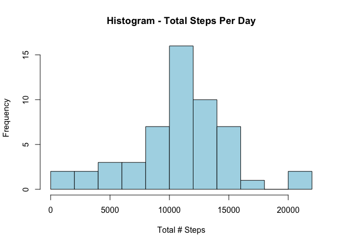

# Reproducible Research: Course Project 1

## Make sure all required packages are loaded.


## Loading and preprocessing the data

* Load Data

```r
unzip("activity.zip")
data <- read.csv("activity.csv")
```

* Process and prepare data for analysis

```r
dailySteps <- tapply(data$steps, data$date, sum)
```


## What is mean total number of steps taken per day?

* Plot Histogram to visualise the total day by day steps:


```r
hist(dailySteps, breaks = 15, main = "Histogram - Total Steps Per Day", 
     xlab = "Total # Steps", col = "lightblue")
```

<!-- -->


* The mean and median total number of steps taken per day.

```r
mean(dailySteps, na.rm = TRUE)
```

```
## [1] 10766.19
```

```r
median(dailySteps, na.rm = TRUE)
```

```
## [1] 10765
```

## What is the average daily activity pattern?

* Time Series Plot of the average number of steps, 5 minute interval and average across all days.


```r
avgInt <- aggregate(list(data$steps), 
                    by = list(data$interval), FUN = mean, na.rm = TRUE)

colnames(avgInt) <- c("Interval", "Average Steps")

plot(avgInt, type="l")
```

<!-- -->

* Which 5-minute interval, on average across all the days in the dataset, contains the maximum number of steps?

```r
avgInt[avgInt[2] == max(avgInt[2]), 1]
```

```
## [1] 835
```


## Imputing missing values

* Calculate and report the total number of missing values in the dataset (i.e. the total number of rows with NAs)

```r
colSums(is.na(data))[1]
```

```
## steps 
##  2304
```
* Total rows are missing.

* Devise a strategy for filling in all of the missing values in the dataset. The strategy does not need to be sophisticated. For example, you could use the mean/median for that day, or the mean for that 5-minute interval, etc. I use the mean for 5-minute interval as replacement for the missing values.

* Create a new dataset that is equal to the original dataset but with the missing data filled in.


```r
library(plyr)
rep_na <- ddply(data, .(interval), 
                transform, steps = ifelse(is.na(steps), 
                                          round(mean(steps, na.rm=TRUE)), steps), digits = 0)

perDayT <- tapply(rep_na$steps, rep_na$date, sum)
```

* Make a histogram of the total number of steps taken each day.


```r
hist(perDayT, breaks = 15, 
     main = "Daily Steps Taken Frequency (Null data Replaced)", 
     xlab = "Total Steps", col = "lightblue")
```

<!-- -->

*  Calculate and report the **mean** and **median** total number of steps taken per day..


```r
mean(perDayT)
```

```
## [1] 10765.64
```

```r
median(perDayT)
```

```
## [1] 10762
```
* Do these values differ from the estimates from the first part of the assignment? What is the impact of imputing missing data on the estimates of the total daily number of steps?

The Mean and Median values are the same as the value before imputing the missing data.
* possibly due to putting the mean value for the particular 5-min interval. 

## Are there differences in activity patterns between weekdays and weekends?

* Make a panel plot containing a time series plot (i.e. `type = "l"`) of the 5-minute interval (x-axis) and the average number of steps taken, averaged across all weekday days or weekend days (y-axis). The plot should look something like the following, which was created using **simulated data**:


```r
rep_na$day <- ifelse(weekdays(as.Date(rep_na$date)) == "Sunday", "Weekend", ifelse(weekdays(as.Date(rep_na$date)) == "Saturday", "Weekend", "Weekday"))
avgIntDay <- aggregate(steps ~ interval + day, data = rep_na, mean)

library(lattice)
xyplot(avgIntDay$steps ~ avgIntDay$interval | avgIntDay$day, avgIntDay, 
       layout = c(1, 2), type = "l", xlab = "Interval", ylab = "Steps")
```

<!-- -->

